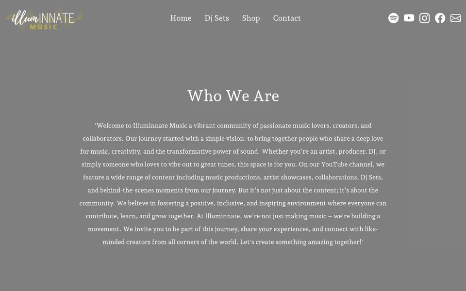

# Illuminnate Music

Web de Illuminnate Music, una comunidad de música: quiénes son, sets de DJ con estadísticas de YouTube, tienda y formulario de contacto.

👉 **En vivo:** https://illuminnatemusic.netlify.app/



## Stack

- **Front:** Astro, Tailwind CSS, TypeScript y JavaScript.
- **Back:** Flask (Python) para el formulario de contacto, que manda los mensajes por mail.
- **Deploy:** Netlify.

## Cómo correrlo

```bash
git clone git@github.com:salvaromanelli/Illuminnate-music.git
cd Illuminnate-music
npm install
npm run dev   # http://localhost:4321
```

El backend del formulario, en otra terminal:

```bash
pip install flask flask-mail flask-cors python-dotenv
python app.py
```

Variables de entorno (en un `.env`, que no se sube al repo):

| Variable | Para qué |
|---|---|
| `MAIL_USERNAME`, `MAIL_PASSWORD` | Cuenta de mail que envía los mensajes del formulario |
| `PUBLIC_YOUTUBE_API_KEY` | Estadísticas de los sets en YouTube |
